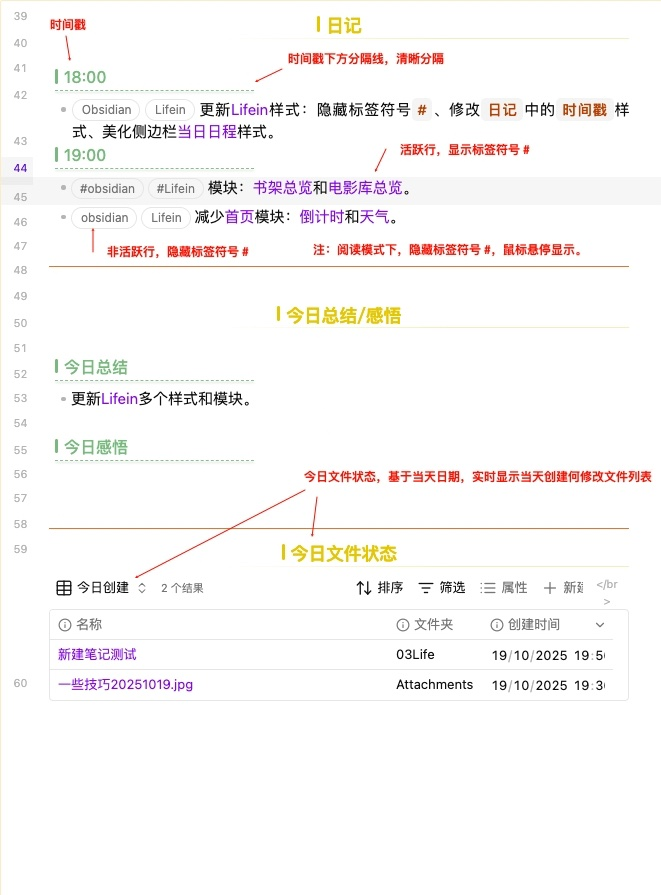

### 说明
这个日记模板用了很长时间，也不断打磨，分享出来，给大家一个参考。

#### 1. 时间戳
- 以四级标题`####`为分隔
- 清晰显示记录时间，并用下方虚线分隔日记内容；
- 日记内容更简洁、美观，强化信息层次感，同时减少视觉负担。

#### 2. 隐藏标签符号·#·

减少视觉干扰，让文档视觉更干净、阅读更流畅；
- 编辑模式下：激活标签所在行时显示 `#`，方便编辑和识别标签；
- 阅读模式下：鼠标悬停显示 `#`，保持标签功能可见；
- 保持列表与段落排版整齐，同时不影响标签搜索和管理功能。
