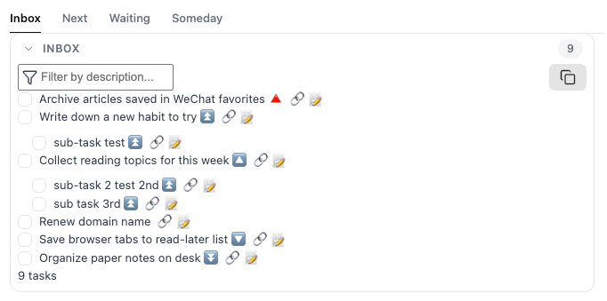
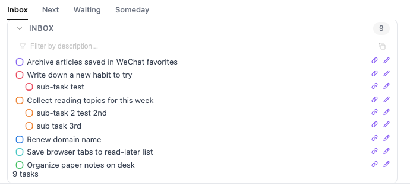

## TaskFlow Task List Enhancements: Priority Colors · Single-Line Fade · Monochrome Icons · Compact Layout

<table width="100%" border="0" cellspacing="0" cellpadding="0">

 <tr>
   <td width="50%" align="center">
     <strong> Before </strong>
   </td>
   <td width="50%" align="center">
     <strong> After </strong>
   </td>
</tr>

	
<tr>
	<td width="50%">
		
	</td>
	<td width="50%">
		
	</td>
</tr>

</table>


### Style Features:

- **Visual Refinement:**
    - Hide the default priority emoji icons and use checkbox border colors to distinguish task priorities — purple (highest), red (high), orange (medium), blue (normal), cyan (low), and green (lowest). Priorities are instantly recognizable at a glance.
- **Enhanced Interaction:**
    - Task descriptions are displayed on a single line by default, with a subtle fade at the end to indicate truncated content. Hover over a task to automatically expand the full description, balancing space efficiency with readability.
- **Minimal Icons:**
    - Built-in custom icon fonts replace the default icons for dates, IDs, recurring tasks, and other metadata with clean, monochrome icons for a more consistent visual style.
- **Compact Layout:**
    - Tighter spacing for group headings, list containers, and task rows eliminates the excessive whitespace in editing mode and creates a denser, cleaner layout.
- **Cross-Platform Support:**
    - Optimized for mobile devices, especially iOS, with adjustments to icon alignment, date picker positioning, and touch interactions for a more consistent experience across platforms.
- **Toolbar Fade:**
    - The search box and copy button remain semi-transparent by default and become fully visible when hovering over the toolbar, keeping the interface quiet and unobtrusive.
- **Nested Task Fix:**
    - Replaces absolute positioning with normal flow layout to prevent checkbox alignment issues when parent and child tasks are displayed together.
- **Hover Feedback:**
    - A theme-colored underline appears beneath the task row when hovered, providing a clear visual cue that the row is interactive.

---
## TaskFlow 任务列表优化：优先级配色 · 单行渐隐 · 单色图标 · 紧凑布局

### 样式特点：
- **视觉瘦身**：
    -  隐藏默认的优先级表情图标，改用复选框边框颜色区分任务等级——紫（最高）、红（高）、橙（中）、蓝（普通）、青（低）、绿（最低），优先级一目了然。

- **交互增强：**
    - 任务描述默认单行显示，末尾以渐隐效果提示内容未完；鼠标悬停时自动展开全文，兼顾空间与可读性。

- **极简图标：**
    - 内置自定义图标字体，将日期、ID、重复等属性统一替换为精致单色图标，风格更协调。

- **空间压缩：**
    - 大幅收紧分组标题、列表容器与行间距，消除编辑模式下松散的空隙感。

- **全端适配：**
    - 针对移动端（iOS）优化图标偏移、日期选择器位置与点击交互，保证各端体验一致。

- **工具栏渐显：**
    - 搜索框与复制按钮默认半透明，悬停工具栏时整体高亮，界面安静不抢眼。

- **嵌套修复：**
    - 改用正常流布局替代绝对定位，解决父子任务混排时复选框垂直错位的问题。

- **悬停反馈：**
    - 鼠标划过任务行时底部显示主题色下划线，清晰提示该行可交互。

---

## CSS Code

<details>
<summary>Click to expand and copy code / 点击展开复制代码</summary>

```

/* =========================================================
   Tasks Toolbar
   Based on the current Tasks DOM
   ========================================================= */

/* Toolbar */
.block-language-tasks .plugin-tasks-toolbar {
    display: flex !important;
    flex-direction: row !important;
    justify-content: space-between !important;
    align-items: center !important;

    gap: 6px !important;
    padding: 2px 6px !important;

    opacity: 1 !important;
}


/* =========================================================
   Filter Label
   ========================================================= */

.block-language-tasks .plugin-tasks-toolbar label {
    position: relative !important;

    display: flex !important;
    flex: 1 1 auto !important;

    flex-direction: row !important;
    align-items: center !important;

    min-width: 0 !important;
}


/* =========================================================
   Filter Icon
   ========================================================= */

.block-language-tasks .plugin-tasks-toolbar label svg.lucide-filter {
    position: absolute !important;

    width: 12px !important;
    height: 12px !important;

    left: 5px !important;
    top: 50% !important;

    transform: translateY(-50%) !important;

    stroke-width: 1.3 !important;

    color: var(--text-muted) !important;

    pointer-events: none !important;

    z-index: 2 !important;
}


/* =========================================================
   Filter Input
   ========================================================= */

.block-language-tasks .plugin-tasks-toolbar label input[aria-label="Filter results"] {
    width: 100% !important;
    height: 22px !important;
    min-height: 22px !important;

    padding: 0 8px 0 24px !important;

    font-size: 12px !important;
    line-height: 22px !important;

    border: none !important;
    border-radius: 5px !important;

    background: rgba(var(--background-modifier-hover-rgb), 0.1) !important;

    box-shadow: none !important;

    outline: none !important;

    transition:
        background 0.15s ease,
        color 0.15s ease !important;
}


/* Placeholder */
.block-language-tasks .plugin-tasks-toolbar label input[aria-label="Filter results"]::placeholder {
    color: var(--text-muted) !important;
    opacity: 0.55 !important;
}


/* Focus */
.block-language-tasks .plugin-tasks-toolbar label input[aria-label="Filter results"]:focus {
    background: var(--background-modifier-hover) !important;
}


/* Filter icon while focused */
.block-language-tasks .plugin-tasks-toolbar label:has(input[aria-label="Filter results"]:focus) svg.lucide-filter {
    color: var(--text-normal) !important;
}


/* =========================================================
   Copy Button
   ========================================================= */

.block-language-tasks .plugin-tasks-toolbar button[aria-label="Copy results"] {
    flex: 0 0 22px !important;

    width: 22px !important;
    height: 22px !important;
    min-height: 22px !important;

    padding: 0 !important;
    margin: 0 !important;

    display: flex !important;
    align-items: center !important;
    justify-content: center !important;

    border: none !important;
    border-radius: 5px !important;

    background: transparent !important;
    box-shadow: none !important;
}


/* Copy Icon */
.block-language-tasks .plugin-tasks-toolbar button[aria-label="Copy results"] svg.lucide-copy {
    width: 12px !important;
    height: 12px !important;

    stroke-width: 1.3 !important;

    color: var(--text-muted) !important;
}


/* Copy Hover */
.block-language-tasks .plugin-tasks-toolbar button[aria-label="Copy results"]:hover {
    background: var(--background-modifier-hover) !important;
}

.block-language-tasks .plugin-tasks-toolbar button[aria-label="Copy results"]:hover svg {
    color: var(--text-normal) !important;
}


/* =========================================================
   Dark / Light
   ========================================================= */

.theme-dark .block-language-tasks .plugin-tasks-toolbar label input[aria-label="Filter results"] {
    background: rgba(var(--background-modifier-hover-rgb), 0.18) !important;
}

.theme-light .block-language-tasks .plugin-tasks-toolbar label input[aria-label="Filter results"] {
    background: rgba(var(--background-modifier-hover-rgb), 0.08) !important;
}


/* =========================================================
   Toolbar Hover Highlight
   Subtle at rest, highlighted on hover
   ========================================================= */

/* ---------- Default state ---------- */

.block-language-tasks .plugin-tasks-toolbar label svg.lucide-filter {
    color: var(--text-faint) !important;
    opacity: 0.55 !important;
}

.block-language-tasks .plugin-tasks-toolbar label input[aria-label="Filter results"] {
    opacity: 0.65 !important;
}

.block-language-tasks .plugin-tasks-toolbar button[aria-label="Copy results"] {
    opacity: 0.55 !important;
}


/* ---------- Toolbar Hover ---------- */

.block-language-tasks .plugin-tasks-toolbar:hover label svg.lucide-filter {
    color: var(--text-muted) !important;
    opacity: 1 !important;
}

.block-language-tasks .plugin-tasks-toolbar:hover label input[aria-label="Filter results"] {
    opacity: 1 !important;
}

.block-language-tasks .plugin-tasks-toolbar:hover button[aria-label="Copy results"] {
    opacity: 1 !important;
}


/* ---------- Input hover / focus ---------- */

.block-language-tasks .plugin-tasks-toolbar label input[aria-label="Filter results"]:hover {
    background: var(--background-modifier-hover) !important;
}

.block-language-tasks .plugin-tasks-toolbar label input[aria-label="Filter results"]:focus {
    opacity: 1 !important;
    background: var(--background-modifier-hover) !important;
}


/* ---------- Copy Button Hover ---------- */

.block-language-tasks .plugin-tasks-toolbar button[aria-label="Copy results"]:hover {
    opacity: 1 !important;
    background: var(--background-modifier-hover) !important;
}

.block-language-tasks .plugin-tasks-toolbar button[aria-label="Copy results"]:hover svg {
    color: var(--text-normal) !important;
}


/* ---------- Smooth transitions ---------- */

.block-language-tasks .plugin-tasks-toolbar label svg.lucide-filter,
.block-language-tasks .plugin-tasks-toolbar label input[aria-label="Filter results"],
.block-language-tasks .plugin-tasks-toolbar button[aria-label="Copy results"] {
    transition:
        opacity 0.2s ease,
        color 0.2s ease,
        background 0.2s ease !important;
}


/***************************************************************
 * Obsidian Tasks - highly customized styling
 * 1. Visual slimming: hide the default priority icons and map task priority
 *    to the checkbox color (red / orange / cyan).
 * 2. Interaction: task descriptions stay on a single line with a trailing fade,
 *    and expand to the full text on hover.
 * 3. Minimal icons: a custom icon font turns due dates, IDs, recurrence and other
 *    attributes into refined monochrome glyphs.
 * 4. Space saving: aggressively trim group headings, list containers and line
 *    spacing to remove the gaps seen in editing mode.
 * 5. Cross-platform: tune icon offsets, the date picker and click behaviour
 *    for mobile (iOS).
 * Author GitHub: https://github.com/ichris007
 * Original source: https://github.com/obsidian-tasks-group/obsidian-tasks/discussions/3419
 ****************************************************************/

/*****************************************
 * Replace the emoji used in Tasks with monochrome SVGs
 *****************************************/
@charset "UTF-8";

/*!
Included icons were modified from https://lucide.dev
License reproduced from https://lucide.dev/license
*/
/*! Generator: obsidian-tasks-custom-icons v1.0.6 https://github.com/obsidian-tasks-group/obsidian-tasks-custom-icons */
@font-face {
	font-family: 'TasksMonoEmojis';
	src: url('data:@file/octet-stream;base64,d09GMgABAAAAAA+EAAsAAAAAH0QAAA81AAEAAAAAAAAAAAAAAAAAAAAAAAAAAAAAHINuBmAAh04KplygbAtSAAE2AiQDgSAEIAWEageCMBs7G7MDMWwcECB790j2f0jgVDZ4XpiqQ5FQimwkU1CCRDKJw65F1u3TmjYub25Z8+l/DNf8i1sOMxyT1oQJB+gISWb9/7cL7/sarDU7fwexK4qdUVQ5qdlBnSqokqqkXh54Lvdvcji2SLqxl5cVn2kkAQW+gPbof3x/wkO0zVuJDRi4ma8CuiKtB4MWtBGsAp/QZvsXt8ZoFpHvyrnIwlXU4bYQLW0hYZH070m8T26GOQM4mNx3AIBb3TIAHGxLSevQOjITeakgFdXxIdsv2X5QcYW7uUDy19qrvddkZy6TKwAErygcuzqH727z093b/9NL74fxgqCQdCayro44SQHIAYAuC1PdqfAdX1nhdVWl7UMmC/E9dEc/RMOW5fJU6E0qyrJUPJSe/mAmPyUIYOtuKNYfMW4a4tnibRtQJgAAQLAuS9nqlYthzi0CGEbMGwqOiKrrag4O4Roe27gGIfWlCbQKdWuJlFdQVMIoZYrFUeUqKMiraEkwOWqj3CZHYQtJzKr7HE2uhlk4QirRuihlnsXYKoNdVlMfoeRykkJGaCDO0RjOn2UocGjdT5NjglCuneeqhewoU7nCvB55RZlfsFV11JvORDWxyI9EvKCYgIOOMYhGcA8E5+mZRUsicwcFuUlpIlPOKcblIIqn2HJKzW+ZI+1QeSZDXotfBMSC/DaJyuESyqoURDVpOLkI/wZnSBAtuQugvPnx+cKUCYCREdhFTFoxfBnum7QZL8FNc91fcww2lwgcOucKoDPMPwuCeCM5e3js7q2tSuKiFmM1NmE7duof+qqf+uOvgiQYF3KxDbAYS7EWW4DFXerJIkm1UAn11H/hgVGAzuwmR46wBfM8DTUVV53kf9CuQFRMXEJSSlpGFigFoxX7O6Hh5Fp+Hl6tVinXUciXXASGXlGjaEsOuBYvQRNoKVTJMmiS5eCQFZAjK6FFVoFPVkOerAWPrIMGWQ81sgEqZCOUySaoky1QIFuhSLZBiWwHl+yUsgWKPsmIKvoiI6boq4y4op8yEor+yEgq/kpGSgkSGWklGMjIKMFMhSx6XVADhD4P1MDQ94kaOPo+U4NA349qkOhHakChX0ENGOg3UA2Y6DdYDVjoN0QN2Oj/azhEYoBwDpOyBoDq29xLY+U6CksMJ1CQzYmmKwITkjecoYaz8ysV612zA+utsh2UczEtU9N4PXJsgGqqR9RKZpPRgs/sWdoTExNzJTpqOTks6/YoVz/CbKKSlxqlxbjXiueNeyG7LnvFcJ0VyCOMIcOqbswHVdIQCKXmAYc5vNESLIblTWMai4bEJlbMVbyxeNDxmBtaIJpvmeBnjvC3zT0qFhroy+NBsQ0EwvbxYSWAw8M4rZstjVMAj/n2LbH60ALPD+xZOPOBRTeX1EtEJSySP1wY4M0WZncH+0EgLSBTuePd8LYPon2+PCw1t4NQ2DCAbxn8nEPoLIA+ZDOImqhekOsyeh4XiykFoZCQBo5JPQxEmthfgMMgDaC/MQb5QHB8kGE3NiCJPCUqdQew5YYz5Wj5j9xc5/M1ZwqN6IYD5KSJROovr5miH1H8BN2ZSSixH8PzMKWQEF07X/dxg9nCJ7R0CtYgx2XjZkmHEGjtZPrpdMENGcn1imbysqqNU+/g6MZW5uqGFp1UiJbBkgPrWJG1mJzFAWtNFCKx/22xbHn1mbfnWq4ah7Xx0QM2E4VYjMPS8H5aYVtH4pAInUP/+seNk3dWb3y89fl6c7Ok/aemqsR9LI8gHzyMQ9ANPediI3t+uBWIII115i8LtPasfNr07lXBvW+avPzHLXCuQJ9p49gxDlzRUkxHQ2JeTkYsn1nBg7mjxgFzIGGJz5eoF0vHg0JufvoaH3kob6wq0Dycb8szlLKjw2gl1thfy7PwU3LNd/OTmzhy+4tMT88fBinat+hRQ6eLdiRtV+1TRd5sHRUGuUhl8DpoWZxEEipCNc+iYfzWsnLE3cLOH56uHbmwchu0ppdkQow6/v66hg2eFV09BhECQmHVPxeLPY/RdZ8jO3Jn4n7xrH1sShTyQT8XjR3DzkFD4hg8rKlj3Z7BB3OtVqOFz2lu5yS0QpvJEc11uT2QPGIctAY5PCxpMhFJNeWq5cnj8JAqzx7EWXMMAKY7DQSKDCmXwIhWIUnq8zF0IE19gg+5UWV2GQytL2dPsiA53WgEgH7udHQ4GwgJYY9pg0vuqo7S/l0X06bhw83dXWLaeY1OHKelB1lYa/QzZHxTG+g0k40qYmIhaA1HFifhAFYGZ2e+7CM3CQvie7zQRApyYKVNpPzUNDQkCt1S6gXFa7pq+ePQhw7k5BEXnptDZnh+bitbetTlKoimZQgcFN3O5+e+dSya2fxacVByKx52O57U1PBnRHWFL/PzZz58OIPfHRWGAQ+8MliQYP8zHj6aweuGGYx9RKn0eXkY08T4vcyPMXfuZGIM028EPNwYi2Oy8uZryWahjNo/jJFVH7VC+Mw9NrRSsdAZWl0ZGut+u/8hVfIVJR7OCxRVIdGp3FWcrt/vfo7aMoOBr6g8FqUd0N/DHz35+jj9kN8qyuSHXNXYYJnLaLbzEX6+6pZIs8RKKF6yjEAtpvwV8BeUbo87tZgH8jxtipb/n0uII0rhc7qGir0+PKYKyRkUFaJ0v3/z4N2eNUTgToBQAQJdzg6awJ0QKvICufSl6ZQMXTr4rW975hBzR9h/Lt74404ypztxgTqNz9Hs4L8vNFF79g9UttnWeAgRoFD8higLkYrW6JKoyJLoF9F1aElkQAj2FYsSCaxWOcKUb4heqOB9s0IY1I/1QzpBI/YCQiALZoFQEAEIVl/ps79y/ppKRK2vbY+zJC+b3sjBmHW9vXVMjE1A2Sbmll5WHRtrnJ60LM5S267WVyI75Py/pLQPrJ6F5NNzqG1ttBx6vm6GFk+xNHVm5pYqyczKHcxky8ucoRNNao6KCZjUp52JnCyif927owsXLhjY10v+QiFdQAvggX1ock+LDUtusGDJKNGA9lyA4rF3JsidpI5towbzrx7j2ILKWwVr/o8pkmer0fF0EjcjAgDQ0mK52CZJCEAcK7il4muXQLwMfPm6e7fNplaXlcVbqtF0CChi553kHWeGidt0oLRvGNHa/Kk2tzKnNcRC73KscNSPLh6RHZ+vdqDuwEcGI4MHug8G30A75HTofX+TIpPyl8hVDjWON6/1tYUjYaUej2NuSHPjdWX8gogxJJNzJWQI2NgRXhKpdTYlPPGZVeDj3BSD8uuObKhnjGM2+hxiUa3ET825NTmGkBa6BcROeeu5jHQtw0ExSjaCLfzatfnGl7cxt9ptoyqvrjqnsPXHB89wk3nIqw3WYKowpt6sgnFYFSqkpVX4GH0MPjlOhTLS/Kt9ywuppm9b/9mUweND2W/SFsb+ZEf5Vfv9ylIBkCutc6p20o0oHyXN+9K9+caXezI/sc9c8ttVe3NtNnnwDHeZu7xab6VaqWPM9RJ4PU9irn+fAiUGAHbQPJIR53C4HCmMw9IyrQRWabVSWII3uH6e9g58fjG12YEKkmFKi0AYJoXVsoSXZAayZxYsnZwhCpYKhv4bSnrMgPJ0VpDohKfMbm0HtHF9ahKZwC13TxjawYgSF1CqoPL1OamMcspiQtdvnYxMlqEHbgD8VuAtXCKKH7PItyOAsHIOZybrt5NvyaMoQf2ABIZkFNu0mJITlzIRPUkgynt65CFb520tcXWdkuku9G5gc+QMKagHqRTNSnPZSmUTdaHPWIWw8siHaXK73NCUn3epzE6LUrFrHbg3zjeT5TPfJRaTl7Nmzw5KCScSZTVlaq3ys8bi6NabPEOzF6gugRMVQ42TuIhIagfpoOMTV0AzMcg2NfoWKdBBw4+GToDE+BEbcAksff3q9WsJbz0s8fPD5wTMxf18caN4UmSnSQaaQSJJnGooUoqbDfXilgVhUrtGlHNZ6MdSRTdQtSKl2axEzT/jZDnqZLNSpKUa6FW1FxSpknpzzQIYQy2z5ydUUrUhhqqBFi7KNvVuMTExDjr1AgHZEo2dbzDgYdKyn+xC40XL8aRKVJmaE8ObOvA8eJ3+pDV4d/f8PV571kt4klBujhqW9tuksGT9Xq+98+3MhGmHbbYsEofVIXL+3qFtEQkMCrt/Xfo+pl8gIkQC/fohHXSZZOVP7XCWC6cB513264MtRGPrpsAXsJh+xKiev7XYlT7yLnLt5iJ/XUNGtlJzMOChN0+6wLMFTxrQILtvO1OORslMZTDSmMpjCwY88MqOY7O0PaT90eAa2jd7ET6HBCFQEYQKMH8W5D0gB4Bl06O7+Ddu8DpjpgsRQ+KNm1285yNaBvq6ZQsiJJrdIp+7YqIYWDBOHbO3l1nHwQgclGnq3VLHwtgW0IiyTawtW1gmNtooaENLsDyN4Tc6+Wk8YgMuppSVK+fOtQ5w+jRuBPwrzxvMEosBZ8rTotmgQip0nHDW2gOcmS+FJYA3f+704NuasHbcMv8zBkf0znu882ppJ39a3n16ZZx+hJ00q8TTp5qCycHBdmCF2leVyo8zyI9pC0s6nJF8ktb6ULXKBQDVfFGIrUvFsgTwsTpsTuBDAIt9G8euVcjCLS8OFXHSW9xjMyQHplmraDfgLwfIoXgPRRPcfbjDoxsSCxOD/5tOxksMk2j14HCOiQE6CBOq5orU7gGEOcNhPfeT+Kit1nD98L8Rk4kdOg81BDbcZpO2Gkh6KsglCXB9GEPCh0vIgyCejxTRmyuJDPOxdTLh1BEZu8FRbIHUnRj6MHE3OAdylwsgr3ykvH8+Sj2wfWwzKLQjfCmDA+9SP8StqZtz1Wg1fDVCbZza9o7XSPSURgm3xmtfiw6zyMaRv+BBf5u3rncM/kIsh5rZxWe6nqaS8YUNinX6TaP+fpxVGpoyeAPCpIT1uIYAWX+gj0Lxtw6SiiR4uIo6SUBsBFgWsUGQNRMyYfiIR3H9YFeQSxY6kpdkN5CWzzVyijERmWDXWrlYjG9REzQTt4UtR9arGAZMkhVV0w3Tsh3X86WkZWTl5BUUlZRVVNXUNTiaXFqLxxcIdQjul0+GN1NO5dnsEOi3DEf3FxJ+tbKu+zMclZrLVzk6PR0Ws9OsxVVuGYH6C6foGhyQe5IELDDq+rME6MPv7KRqM1qk4ejnWoT/DV4TXb5e7OxNTukNRo0aVWmVwM/AE0woSEsG') format('woff2');
	unicode-range: U+23E9, U+23EB, U+23EC, U+23F0, U+23F3, U+26D4, U+2705, U+274C, U+2795, U+1F194, U+1F3C1, U+1F4C5, U+1F4CD, U+1F4DD, U+1F501, U+1F517, U+1F53A, U+1F53C, U+1F53D, U+1F6EB;
	/* U+23E9:⏩, U+23EB:⏫, U+23EC:⏬, U+23F0:⏰, U+23F3:⏳, U+26D4:⛔, U+2705:✅, U+274C:❌, U+2795:➕, U+1F194:🆔, U+1F3C1:🏁, U+1F4C5:📅, U+1F4CD:📍, U+1F4DD:📝, U+1F501:🔁, U+1F517:🔗, U+1F53A:🔺, U+1F53C:🔼, U+1F53D:🔽, U+1F6EB:🛫 */
}
@supports (-webkit-touch-callout: none) {
	/* Target Safari iOS */
	@font-face {
		font-family: 'TasksMonoEmojis';
		src: url('data:@file/octet-stream;base64,d09GMgABAAAAAA+EAAsAAAAAH0QAAA81AAEAAAAAAAAAAAAAAAAAAAAAAAAAAAAAHINuBmAAh04KplygbAtSAAE2AiQDgSAEIAWEageCMBs7G7MDMWwcECB790j2f0jgVDZ4XpiqQ5FQimwkU1CCRDKJw65F1u3TmjYub25Z8+l/DNf8i1sOMxyT1oQJB+gISWb9/7cL7/sarDU7fwexK4qdUVQ5qdlBnSqokqqkXh54Lvdvcji2SLqxl5cVn2kkAQW+gPbof3x/wkO0zVuJDRi4ma8CuiKtB4MWtBGsAp/QZvsXt8ZoFpHvyrnIwlXU4bYQLW0hYZH070m8T26GOQM4mNx3AIBb3TIAHGxLSevQOjITeakgFdXxIdsv2X5QcYW7uUDy19qrvddkZy6TKwAErygcuzqH727z093b/9NL74fxgqCQdCayro44SQHIAYAuC1PdqfAdX1nhdVWl7UMmC/E9dEc/RMOW5fJU6E0qyrJUPJSe/mAmPyUIYOtuKNYfMW4a4tnibRtQJgAAQLAuS9nqlYthzi0CGEbMGwqOiKrrag4O4Roe27gGIfWlCbQKdWuJlFdQVMIoZYrFUeUqKMiraEkwOWqj3CZHYQtJzKr7HE2uhlk4QirRuihlnsXYKoNdVlMfoeRykkJGaCDO0RjOn2UocGjdT5NjglCuneeqhewoU7nCvB55RZlfsFV11JvORDWxyI9EvKCYgIOOMYhGcA8E5+mZRUsicwcFuUlpIlPOKcblIIqn2HJKzW+ZI+1QeSZDXotfBMSC/DaJyuESyqoURDVpOLkI/wZnSBAtuQugvPnx+cKUCYCREdhFTFoxfBnum7QZL8FNc91fcww2lwgcOucKoDPMPwuCeCM5e3js7q2tSuKiFmM1NmE7duof+qqf+uOvgiQYF3KxDbAYS7EWW4DFXerJIkm1UAn11H/hgVGAzuwmR46wBfM8DTUVV53kf9CuQFRMXEJSSlpGFigFoxX7O6Hh5Fp+Hl6tVinXUciXXASGXlGjaEsOuBYvQRNoKVTJMmiS5eCQFZAjK6FFVoFPVkOerAWPrIMGWQ81sgEqZCOUySaoky1QIFuhSLZBiWwHl+yUsgWKPsmIKvoiI6boq4y4op8yEor+yEgq/kpGSgkSGWklGMjIKMFMhSx6XVADhD4P1MDQ94kaOPo+U4NA349qkOhHakChX0ENGOg3UA2Y6DdYDVjoN0QN2Oj/azhEYoBwDpOyBoDq29xLY+U6CksMJ1CQzYmmKwITkjecoYaz8ysV612zA+utsh2UczEtU9N4PXJsgGqqR9RKZpPRgs/sWdoTExNzJTpqOTks6/YoVz/CbKKSlxqlxbjXiueNeyG7LnvFcJ0VyCOMIcOqbswHVdIQCKXmAYc5vNESLIblTWMai4bEJlbMVbyxeNDxmBtaIJpvmeBnjvC3zT0qFhroy+NBsQ0EwvbxYSWAw8M4rZstjVMAj/n2LbH60ALPD+xZOPOBRTeX1EtEJSySP1wY4M0WZncH+0EgLSBTuePd8LYPon2+PCw1t4NQ2DCAbxn8nEPoLIA+ZDOImqhekOsyeh4XiykFoZCQBo5JPQxEmthfgMMgDaC/MQb5QHB8kGE3NiCJPCUqdQew5YYz5Wj5j9xc5/M1ZwqN6IYD5KSJROovr5miH1H8BN2ZSSixH8PzMKWQEF07X/dxg9nCJ7R0CtYgx2XjZkmHEGjtZPrpdMENGcn1imbysqqNU+/g6MZW5uqGFp1UiJbBkgPrWJG1mJzFAWtNFCKx/22xbHn1mbfnWq4ah7Xx0QM2E4VYjMPS8H5aYVtH4pAInUP/+seNk3dWb3y89fl6c7Ok/aemqsR9LI8gHzyMQ9ANPediI3t+uBWIII115i8LtPasfNr07lXBvW+avPzHLXCuQJ9p49gxDlzRUkxHQ2JeTkYsn1nBg7mjxgFzIGGJz5eoF0vHg0JufvoaH3kob6wq0Dycb8szlLKjw2gl1thfy7PwU3LNd/OTmzhy+4tMT88fBinat+hRQ6eLdiRtV+1TRd5sHRUGuUhl8DpoWZxEEipCNc+iYfzWsnLE3cLOH56uHbmwchu0ppdkQow6/v66hg2eFV09BhECQmHVPxeLPY/RdZ8jO3Jn4n7xrH1sShTyQT8XjR3DzkFD4hg8rKlj3Z7BB3OtVqOFz2lu5yS0QpvJEc11uT2QPGIctAY5PCxpMhFJNeWq5cnj8JAqzx7EWXMMAKY7DQSKDCmXwIhWIUnq8zF0IE19gg+5UWV2GQytL2dPsiA53WgEgH7udHQ4GwgJYY9pg0vuqo7S/l0X06bhw83dXWLaeY1OHKelB1lYa/QzZHxTG+g0k40qYmIhaA1HFifhAFYGZ2e+7CM3CQvie7zQRApyYKVNpPzUNDQkCt1S6gXFa7pq+ePQhw7k5BEXnptDZnh+bitbetTlKoimZQgcFN3O5+e+dSya2fxacVByKx52O57U1PBnRHWFL/PzZz58OIPfHRWGAQ+8MliQYP8zHj6aweuGGYx9RKn0eXkY08T4vcyPMXfuZGIM028EPNwYi2Oy8uZryWahjNo/jJFVH7VC+Mw9NrRSsdAZWl0ZGut+u/8hVfIVJR7OCxRVIdGp3FWcrt/vfo7aMoOBr6g8FqUd0N/DHz35+jj9kN8qyuSHXNXYYJnLaLbzEX6+6pZIs8RKKF6yjEAtpvwV8BeUbo87tZgH8jxtipb/n0uII0rhc7qGir0+PKYKyRkUFaJ0v3/z4N2eNUTgToBQAQJdzg6awJ0QKvICufSl6ZQMXTr4rW975hBzR9h/Lt74404ypztxgTqNz9Hs4L8vNFF79g9UttnWeAgRoFD8higLkYrW6JKoyJLoF9F1aElkQAj2FYsSCaxWOcKUb4heqOB9s0IY1I/1QzpBI/YCQiALZoFQEAEIVl/ps79y/ppKRK2vbY+zJC+b3sjBmHW9vXVMjE1A2Sbmll5WHRtrnJ60LM5S267WVyI75Py/pLQPrJ6F5NNzqG1ttBx6vm6GFk+xNHVm5pYqyczKHcxky8ucoRNNao6KCZjUp52JnCyif927owsXLhjY10v+QiFdQAvggX1ock+LDUtusGDJKNGA9lyA4rF3JsidpI5towbzrx7j2ILKWwVr/o8pkmer0fF0EjcjAgDQ0mK52CZJCEAcK7il4muXQLwMfPm6e7fNplaXlcVbqtF0CChi553kHWeGidt0oLRvGNHa/Kk2tzKnNcRC73KscNSPLh6RHZ+vdqDuwEcGI4MHug8G30A75HTofX+TIpPyl8hVDjWON6/1tYUjYaUej2NuSHPjdWX8gogxJJNzJWQI2NgRXhKpdTYlPPGZVeDj3BSD8uuObKhnjGM2+hxiUa3ET825NTmGkBa6BcROeeu5jHQtw0ExSjaCLfzatfnGl7cxt9ptoyqvrjqnsPXHB89wk3nIqw3WYKowpt6sgnFYFSqkpVX4GH0MPjlOhTLS/Kt9ywuppm9b/9mUweND2W/SFsb+ZEf5Vfv9ylIBkCutc6p20o0oHyXN+9K9+caXezI/sc9c8ttVe3NtNnnwDHeZu7xab6VaqWPM9RJ4PU9irn+fAiUGAHbQPJIR53C4HCmMw9IyrQRWabVSWII3uH6e9g58fjG12YEKkmFKi0AYJoXVsoSXZAayZxYsnZwhCpYKhv4bSnrMgPJ0VpDohKfMbm0HtHF9ahKZwC13TxjawYgSF1CqoPL1OamMcspiQtdvnYxMlqEHbgD8VuAtXCKKH7PItyOAsHIOZybrt5NvyaMoQf2ABIZkFNu0mJITlzIRPUkgynt65CFb520tcXWdkuku9G5gc+QMKagHqRTNSnPZSmUTdaHPWIWw8siHaXK73NCUn3epzE6LUrFrHbg3zjeT5TPfJRaTl7Nmzw5KCScSZTVlaq3ys8bi6NabPEOzF6gugRMVQ42TuIhIagfpoOMTV0AzMcg2NfoWKdBBw4+GToDE+BEbcAksff3q9WsJbz0s8fPD5wTMxf18caN4UmSnSQaaQSJJnGooUoqbDfXilgVhUrtGlHNZ6MdSRTdQtSKl2axEzT/jZDnqZLNSpKUa6FW1FxSpknpzzQIYQy2z5ydUUrUhhqqBFi7KNvVuMTExDjr1AgHZEo2dbzDgYdKyn+xC40XL8aRKVJmaE8ObOvA8eJ3+pDV4d/f8PV571kt4klBujhqW9tuksGT9Xq+98+3MhGmHbbYsEofVIXL+3qFtEQkMCrt/Xfo+pl8gIkQC/fohHXSZZOVP7XCWC6cB513264MtRGPrpsAXsJh+xKiev7XYlT7yLnLt5iJ/XUNGtlJzMOChN0+6wLMFTxrQILtvO1OORslMZTDSmMpjCwY88MqOY7O0PaT90eAa2jd7ET6HBCFQEYQKMH8W5D0gB4Bl06O7+Ddu8DpjpgsRQ+KNm1285yNaBvq6ZQsiJJrdIp+7YqIYWDBOHbO3l1nHwQgclGnq3VLHwtgW0IiyTawtW1gmNtooaENLsDyN4Tc6+Wk8YgMuppSVK+fOtQ5w+jRuBPwrzxvMEosBZ8rTotmgQip0nHDW2gOcmS+FJYA3f+704NuasHbcMv8zBkf0znu882ppJ39a3n16ZZx+hJ00q8TTp5qCycHBdmCF2leVyo8zyI9pC0s6nJF8ktb6ULXKBQDVfFGIrUvFsgTwsTpsTuBDAIt9G8euVcjCLS8OFXHSW9xjMyQHplmraDfgLwfIoXgPRRPcfbjDoxsSCxOD/5tOxksMk2j14HCOiQE6CBOq5orU7gGEOcNhPfeT+Kit1nD98L8Rk4kdOg81BDbcZpO2Gkh6KsglCXB9GEPCh0vIgyCejxTRmyuJDPOxdTLh1BEZu8FRbIHUnRj6MHE3OAdylwsgr3ykvH8+Sj2wfWwzKLQjfCmDA+9SP8StqZtz1Wg1fDVCbZza9o7XSPSURgm3xmtfiw6zyMaRv+BBf5u3rncM/kIsh5rZxWe6nqaS8YUNinX6TaP+fpxVGpoyeAPCpIT1uIYAWX+gj0Lxtw6SiiR4uIo6SUBsBFgWsUGQNRMyYfiIR3H9YFeQSxY6kpdkN5CWzzVyijERmWDXWrlYjG9REzQTt4UtR9arGAZMkhVV0w3Tsh3X86WkZWTl5BUUlZRVVNXUNTiaXFqLxxcIdQjul0+GN1NO5dnsEOi3DEf3FxJ+tbKu+zMclZrLVzk6PR0Ws9OsxVVuGYH6C6foGhyQe5IELDDq+rME6MPv7KRqM1qk4ejnWoT/DV4TXb5e7OxNTukNRo0aVWmVwM/AE0woSEsG') format('woff2');
		/*
			The following is a specific fix for Obsidian iOS.
			For reasons unknown, a single hardcoded wide range is required to make all of the icons replace correctly.
		*/
		unicode-range: U+02000-1F9FF;
	}
}


span.tasks-list-text,
.cm-line:has(.task-list-label) [class^=cm-list-],
span.task-extras,
.tasks-postpone,
.tasks-backlink,
.tasks-edit::after,
.tasks-modal-priority-section,
.tasks-modal-parsed-date,
.suggestion-container .suggestion {
	font-family: 'TasksMonoEmojis', var(--font-text);
}
span.task-extras {
	display: inline-flex;
	align-items: flex-start;
	margin-left: 0.33em;
}


/*****************************************
 * 1. Task list styling
 * Handles font size, spacing and layout of the task content.
 *****************************************/

.block-language-tasks {

  /* Unified settings for all the "extra info": ID, priority, dates, recurrence, etc. */
  .task-id,
  .task-dependsOn,
  .task-priority,
  .task-recurring,
  .task-created,
  .task-start,
  .task-scheduled,
  .task-done,
  .task-cancelled,
  .task-due,
  .tasks-postpone,
  .tasks-backlink,
  .tasks-edit,
  .suggestion-container .suggestion {
    font-family: 'TasksMonoEmojis', var(--font-text); /* Use the icon font defined above */
    font-size: 0.8rem; /* Icon size */
    line-height: 1.3rem !important;/* Sets the line height, which affects the height of the task list */
    padding: 0px 0.25rem;/* Leave a little breathing room on both sides */
  }

  /* Lay out dates and other extra info horizontally */
  span.task-extras {
    display: inline-flex;
    gap: 1px !important;    /* Gap between elements */ 
    align-items: center;    /* Vertically centered */
  }
  

/***************************************************************
* 2. Adjust the heading and list spacing when the task list is grouped
****************************************************************/

/* 1. Adjust the vertical margins of the heading */
.tasks-group-heading {
  margin-bottom: 0px !important;
  margin-top: 0px  !important;
  padding-bottom: 0px !important;
  /* Added: adjust the text color */
  color: var(--text-muted) !important; /* Use the theme's default muted text color */
  opacity: 0.3; /* 60% opacity, so it looks very faint */
  font-weight: 300 !important; /* Optional: slightly lighter weight for a more airy look */
  font-size: 0.85em; /* Optional: slightly smaller heading font size, to slim it down further */
}
/* 2. Adjust the vertical margins of the query result (the whole task list) */
.contains-task-list.plugin-tasks-query-result {
  margin-top: 2px !important;
  margin-bottom: -6px !important; 
  padding-top: 0px !important;
  border-top: none !important;/* Make sure no top border takes up space */
}

/* 3. Fine-tune the list items so the first one brings no spacing of its own */
.contains-task-list.plugin-tasks-query-result li.task-list-item {
  margin-top: 0px !important;
  padding-top: 0px !important;
}


   /***************************************************************
   * 3. Priority color mapping
   * Change the checkbox border color according to task priority, instead of
   * showing the default priority symbol.
   ****************************************************************/
  
.task-list-item[data-task-priority="highest"] input[type=checkbox]:not(:checked) {
    box-shadow: 0px 0px 1px 1px var(--color-purple);
    border-color: var(--color-purple);
}

.task-list-item[data-task-priority="high"] input[type=checkbox]:not(:checked) {
    box-shadow: 0px 0px 1px 1px var(--color-red);
    border-color: var(--color-red);
}

.task-list-item[data-task-priority="medium"] input[type=checkbox]:not(:checked) {
    box-shadow: 0px 0px 1px 1px var(--color-orange);
    border-color: var(--color-orange);
}

.task-list-item[data-task-priority="normal"] input[type=checkbox]:not(:checked) {
    box-shadow: 0px 0px 1px 1px var(--color-blue);
    border-color: var(--color-blue);
}

.task-list-item[data-task-priority="low"] input[type=checkbox]:not(:checked) {
    box-shadow: 0px 0px 1px 1px var(--color-cyan);
    border-color: var(--color-cyan);
}

.task-list-item[data-task-priority="lowest"] input[type=checkbox]:not(:checked) {
    box-shadow: 0px 0px 1px 1px var(--color-green);
    border-color: var(--color-green);
}

/* This part removes the regular priority emoticon */
span.task-priority {
    display: none;
}


  /* Fix hover issues with Border theme */

  .task-extras {
    --background-modifier-hover: transparent !important;/* Transparent background on hover */
    --link-decoration-hover: none !important;/* Remove the link underline on hover */
  }


  /* Allow .tasks-list-text to shrink and take up remaining space responsively */

   /**************************
   * 4. Layout fine-tuning
   ***************************/
  /* Outer container: the outermost "box" of every task row. */
  .plugin-tasks-list-item {
    display: flex;/* Use flexbox so the checkbox, text and icons line up horizontally. */
    align-items: center;/* Vertically centered */
    position: relative !important; /* Make sure the checkbox is positioned absolutely relative to this container */
    /*border-bottom: var(--hr-thickness) solid;*/
    /*border-color: var(--hr-color);*/
    /*border-top: 1px solid; */
    border-bottom: 1px solid transparent;
    line-height: 1 !important; 
    margin-bottom: 0px !important;
    padding-bottom: 0px !important;
  }
   
   /* Reveal an underline below the text on hover */ 
   .plugin-tasks-list-item:hover {
     border-bottom-color: var(--interactive-accent);/* Border color: text color var(--text-muted) or interactive color var(--interactive-accent) */
   }
    
    /* Checkbox positioning - fixed version */
    .task-list-item-checkbox {
      position: absolute !important;
      left: 4px !important;  /* Explicit left offset to line the checkbox up */
      top: 50% !important;
      transform: translateY(-50%) scale(0.70) translateY(-1px) !important; /* Keep the original scale while centering vertically */
      z-index: 2;  /* Keep the checkbox on the topmost layer */
    }

    /* Task content area: the container wrapping the task text and the trailing date icons. */
    .tasks-list-text {
      display: inline-flex;
      flex: 1;/* Stretch automatically to fill the remaining space */
      align-items: center;/* Vertically centered */
      line-height: 1rem;
      padding-left: 1rem !important; /* Shift everything right so it does not overlap the checkbox */
      pointer-events: auto;   /* Do not let the container itself swallow events */


      /* Task description: show an ellipsis when too long, no wrapping */
      .task-description {
        contain: inline-size;
        flex: 1 !important;/* Let the text part take up as much space as possible. */
        text-wrap: nowrap;/* Force a single line */
        overflow: hidden;/* Hide the overflowing text instead of letting it spill outside the screen. */
        font-size: 13px;
        line-height: 1 !important; 
        padding-top: 1px !important;
        padding-bottom: 0px !important;
        /* Key point: add a gradient so the end of the text fades out */
        mask-image: linear-gradient(to left, transparent, black 2rem);
      }

      /* --- Reveal full text on hover --- */
      .task-description:hover {
        text-wrap: normal !important; /* Override the previous nowrap */
        white-space: normal !important;
        overflow: visible !important;
        mask-image: none !important; /* Remove the mask gradient when expanded */
        position: relative;
        z-index: 10; /* Make sure the expanded content is not covered */
        line-height: 1.3 !important; /* Adjust the line spacing while hovered */
      }      
      

      /* Pop-up / tooltip settings */
      .tooltip.pop-up {
        position: absolute;
        left: unset;/* Cancel the left alignment. */
        right: 0%;/* Align right, so the right edge of the bubble lines up with the right edge of the task item. */
        transform: translate(-0.4em, calc(-100% - var(--hr-thickness) - 1px - 1px)) !important;/* 4em: shift the bubble to the right by some distance; calc(-100% - ...): move the bubble up by
           calculation so it lands right above the task text. It subtracts the line height,
           the border thickness and 5px of extra spacing, keeping the bubble clear of the text. */
        width: fit-content;/* Width fits the content: the bubble widens automatically with its text. */
        max-width: calc(100% - 1em); /* Prevent overflow even in extreme cases */
        box-sizing: border-box;      /* Include the border in the width */

        /* The little bubble pointer: draw a border-only triangle to mimic the arrow
           that points down at the task below the bubble. */
        ::after {
          position: absolute;
          top: 100%;
          left: 50%;
          width: 0;
          margin-left: -5px;
          border-top: 5px solid var(--background-modifier-message);
          border-right: 5px solid transparent;
          border-left: 5px solid transparent;
          content: " ";
          font-size: 0;
          line-height: 0;
        }

      }
    }


    .task-extras {
      margin: 0px !important;

      a,
      span {
        width: fit-content;
        height: fit-content;
        margin: 0px;
      }
    }
  }


/* =========================================================
   TaskFlow — Task Row Layout
   ---------------------------------------------------------
   The checkbox used to be `position: absolute; top: 50%`, i.e. centred on the
   whole <li>. A parent <li> also holds the child list, so it is two rows tall
   and the checkbox landed between the two rows instead of on its own line.
   Putting it back into the normal flow fixes that at any nesting depth.
   ========================================================= */

.block-language-tasks .plugin-tasks-list-item {
  display: flex !important;
  flex-wrap: wrap !important;
  align-items: center !important;
  position: relative !important;

  row-gap: 0 !important;
  margin-bottom: 0 !important;
  padding-bottom: 0 !important;

  border-bottom: 1px solid transparent;
  line-height: 1 !important;
}

.block-language-tasks .plugin-tasks-list-item:hover {
  border-bottom-color: var(--interactive-accent);
}


/* =========================================================
   Checkbox
   ========================================================= */

.block-language-tasks .plugin-tasks-list-item > .task-list-item-checkbox {
  position: static !important;
  order: -1 !important;                 /* the input is appended after the text */
  flex: 0 0 16px !important;

  /* -8px top/bottom: cancel the 16px box so it never adds to the row height.
     4px left: the column the old absolute rule used.
     -4px right: pull the text back in - the box is scaled to 0.7, so 2.4px of
     its 16px slot is empty space on each side. */
  margin: -8px -4px -8px 4px !important;

  /* translate BEFORE scale on purpose: a translate written after scale() is
     applied in the scaled space, so the old translateY(-3px) really lifted the
     box by 3 x 0.7 = 2.1px. That was the "checkbox sits too high" bug. */
  transform: translateY(0.5px) scale(0.7) !important;
}


/* =========================================================
   Task Text
   ========================================================= */

.block-language-tasks .plugin-tasks-list-item > .tasks-list-text {
  flex: 1 !important;

  /* Distance to the checkbox. On screen it shows up as ~1.4px, because the
     0.7 scale leaves 1.6px of empty slot on the right of the box.
     -1px here = 1px closer to the box. */
  padding-left: 3px !important;

  display: inline-flex;
  align-items: center;
  min-width: 0;

  line-height: 1rem;
}


/* =========================================================
   Nested Tasks — Parent / Child
   ========================================================= */

.block-language-tasks .plugin-tasks-list-item > ul.contains-task-list,
.block-language-tasks .plugin-tasks-list-item > ol.contains-task-list {
  flex: 0 0 100% !important;            /* the child list gets a row of its own */
  width: 100% !important;

  /* Keep the row rhythm of a flat list: the stock rule
     `.contains-task-list.plugin-tasks-query-result { margin-top: 2px }` also
     matches the NESTED list (it carries the same class), and themes may add
     margin/padding of their own. Zero all of it, or the parent -> first child
     gap ends up bigger than the gap between two flat rows. */
  margin: 0 !important;
  padding-block: 0 !important;
}

.block-language-tasks .plugin-tasks-list-item > ul.contains-task-list > li:first-child,
.block-language-tasks .plugin-tasks-list-item > ol.contains-task-list > li:first-child {
  margin-block-start: 0 !important;
}


/* Fix the date picker (Flatpickr) offset on different devices */
.flatpickr-calendar {
  margin-left: -0.5rem;
}

.is-ios {
  .flatpickr-calendar {
    margin-left: -1.5rem;
  }

  .block-language-tasks {

    .task-id,
    .task-dependsOn,
    .task-priority,
    .task-recurring,
    .task-created,
    .task-start,
    .task-scheduled,
    .task-done,
    .task-cancelled,
    .task-due,
    .tasks-postpone,
    .tasks-backlink,
    .tasks-edit,
    .suggestion-container .suggestion {
      margin-top: -3px !important;
    }

    span.task-extras {
      margin-top: -2px !important;

    }
    
   /* Make links inside task descriptions clickable and previewable */
    .task-description a,
    .task-description .internal-link,
    .task-description .external-link {
      pointer-events: auto !important;
      z-index: 4 !important;   /* Higher than the checkbox's z-index: 2 */
      position: relative !important;      /* Prerequisite for z-index to take effect */
      cursor: pointer;
   }
}

/* The brace below closes `.is-ios`. It was missing, and a rule appended after
   this point silently ends up nested inside `.is-ios` (iOS only) instead of
   being applied everywhere. */
}

```

</details>

## More resources / 更多资源
- [Lifein](https://lifein.vip) 
