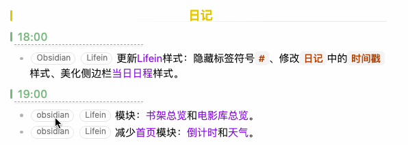

### 简介

这是一套为 Obsidian 打造的智能化日记模板系统，融合了自动化工具、视觉主题与文件追踪功能。它不仅能帮你高效记录日常，还能自动管理习惯追踪、文件动态，并通过每日不同的配色提升辨识度与使用愉悦感。适合提升日记效率、建立长期记录习惯。

这套日记模板是示例库——生产力和人生管理系统[Lifein](https://github.com/ichris007/Obsidian_Lifein)的一部分，感兴趣的可以试试。

### 特点

#### 1. 智能日记模板（`T-Daily.md`）
- 自动生成日期、ISO 周数，文件名格式为 WW_YYYYMMDD
- 自动添加 `DailyNotes` 标签与每日对应的 CSS 类
- 内置习惯追踪字段（读书、写作、健身、早起、社交分享、播客、睡眠时长、体重）
- 导航栏支持前后一天跳转与周回顾链接
- 包含时间分段记录、今日总结、感悟等结构化日记区域
- 日记内容更简洁、美观，强化信息层次感，同时减少视觉负担。

#### 2. 文件追踪系统（`文件操作.base`）
- 三个 bases 视图：最近编辑、今日创建、今日修改
- 自动过滤当前文件，按时间倒序排列
- 清晰显示文件名、时间、所在文件夹
- 帮助使用者掌握每日文件动态，便于回顾与整理

#### 3. 每日主题配色系统（`daily.css`）
- 7 种星期配色（粉、蓝、绿、橙、紫、黄、红）
- 支持浅色 / 深色双主题，自动适配系统主题
- 使用 CSS 变量，样式统一且易于维护
- 优化标签、嵌入块、过渡动画等细节，提升视觉体验

#### 4. 隐藏标签符号`#`（`隐藏标签符号.css`）

减少视觉干扰，让文档视觉更干净、阅读更流畅；
- 编辑模式下：激活标签所在行时显示 `#`，方便编辑和识别标签；
- 阅读模式下：鼠标悬停显示 `#`，保持标签功能可见；
- 保持列表与段落排版整齐，同时不影响标签搜索和管理功能。

### 使用说明

#### 1. 时间戳
- 以四级标题`####`为分隔。输入`#### 18:00`的格式，就会渲染成上图中的样式；(四级标题的颜色字体等样式取决于你Vault的主题)
- 清晰显示记录时间，并用下方虚线分隔日记内容；

#### 2. 模板及文件下载、使用说明
- 下载模板[T-Daily.md](T-Daily.md)放入你的模板目录中。新建日记时用这个模板创建。
  - 我的日记命名格式是：WW_YYYYMMDD。这个文件名命名可能会影响日记属性`week`值的获取，正确的`week`值获取有赖于你通过日记插件或日历插件的设置。
  - 属性中的`date`不要删，它是很多基于日期的内容的依赖。
  - 模板中的`cssclasses`中一定要有`daily`(默认已有)，才会应用`daily.css`样式；另外的`<%* const days = ["sunday", "monday", "tuesday", "wednesday", "thursday", "friday", "saturday"]; tR += days[new Date(tp.date.now("YYYY-MM-DD")).getDay()];%>`是为了获取当天的星期几（不需要的话，可去掉），然后会根据这个值自动匹配不同的主题颜色，效果见：[「日记皮肤」每天自动换色](https://github.com/ichris007/obsidian-share-showcase/blob/main/CSS-snippets/%E3%80%8C%E6%97%A5%E8%AE%B0%E7%9A%AE%E8%82%A4%E3%80%8D%E6%AF%8F%E5%A4%A9%E8%87%AA%E5%8A%A8%E6%8D%A2%E8%89%B2%EF%BC%8C%E5%91%8A%E5%88%AB%E6%9E%AF%E7%87%A5%E7%AC%94%E8%AE%B0.md)
  - 属性中的`number headings`是一个自动给不同标题标号的插件需要的，如果你没有安装这个插件，可以不要这一项。
  - 属性中的`读书、写作...`等是习惯追踪用的，可以自行修改或删除。
- 下载[文件操作.base](文件操作.base)文件，放入库中任意位置。这是日记下方`今日文件状态`的依赖文件，如果你不需要这一部分，可以不用这个base文件。
- 下载[daily.css](daily.css)和[隐藏标签符号.css](隐藏标签符号.css)，放入你的`snippets`目录中。
  - `daily.css`是日记样式，必须启用；
  - `隐藏标签符号.css`是非必要样式（可选项）。
